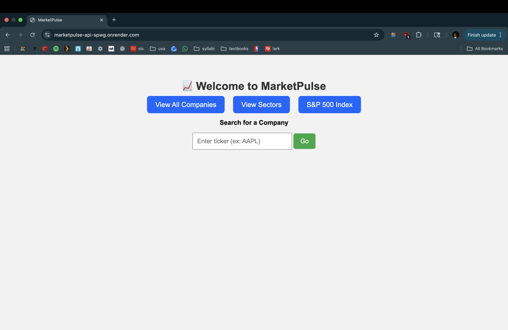
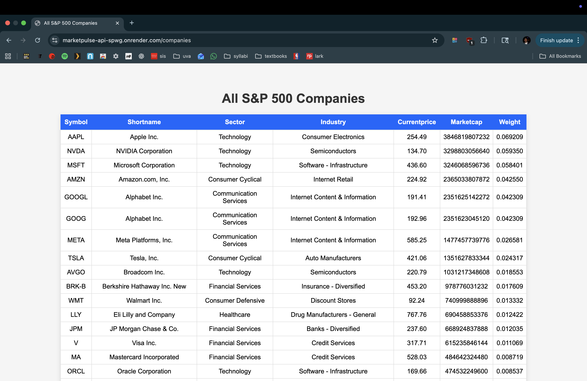
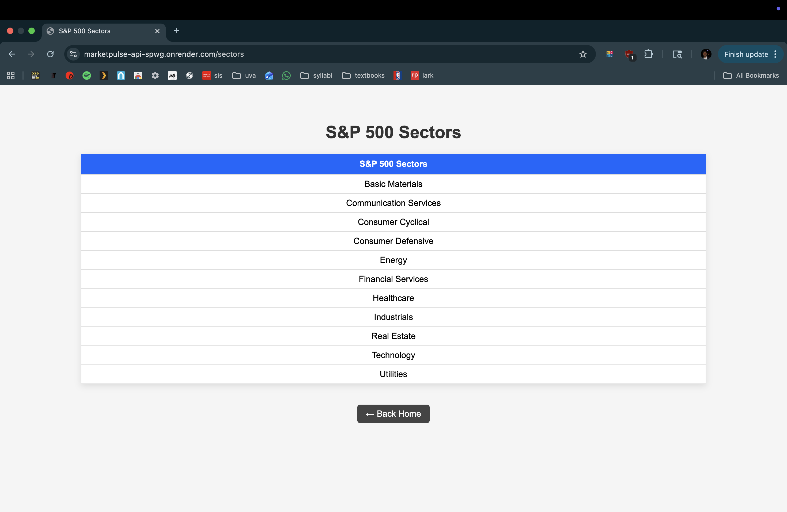
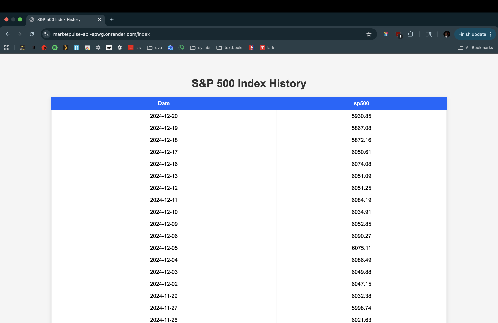
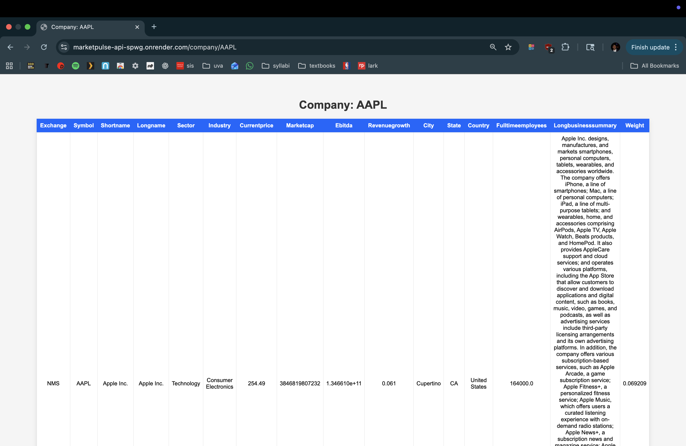

# ✨ MarketPulse — Real-Time S&P 500 Exploration API + Web App  
### *Final Build Anything Project — DS 2022*

---

# 🧭 Executive Summary

The S&P 500 represents one of the most important indicators of U.S. market performance, but most datasets and dashboards for exploring it are either paywalled, slow, or not customizable. The goal of **MarketPulse** is to build a small, efficient, reproducible system that transforms raw S&P 500 datasets into a fully functional, cloud-hosted API and interactive dashboard.

This project ingests two CSV datasets—**sp500_index.csv** and **sp500_companies.csv**—and builds an SQLite-backed data service that supports analytical queries, web endpoints, HTML table views, and sector-level statistics. MarketPulse is deployed via **Render**, containerized using **Docker**, continuously tested using **GitHub Actions**, and structured around the data engineering and API concepts from **Case Study 06**.

---

# 🏗️ System Overview

## 🎯 Project Goals
- Convert raw CSVs into a clean, queryable relational database  
- Build an API that exposes companies, sectors, and index history  
- Render user-friendly HTML tables instead of raw JSON  
- Deploy reproducibly via Docker + GitHub Actions  
- Perform real SQL transformations (joins, aggregations, derived tables)  
- Create an accessible homepage with navigation + search  

---

## 🧩 Concepts Integrated (from Case Study 06)

This project incorporates the following concepts emphasized in Case Study 06:

- Designing structured **SQL queries & joins**  
- Loading external datasets into a normalized SQLite database  
- Creating **derived tables** (e.g., sector-level statistics)  
- Building a structured **Flask application factory**  
- Using **pandas ↔ SQLAlchemy** for data pipelines  
- API routing and HTML template rendering  
- Writing reproducible workflows with **Docker**  
- CI pipeline with **pytest** + GitHub Actions  
- Cloud deployment & observability  

---

# 🖼️ Architecture Diagram

                         +-------------------------+
                         |    sp500_companies.csv  |
                         |      sp500_index.csv    |
                         +------------+------------+
                                      |
                                      v
                         +-------------------------+
                         |                         |
                         |    init_db() Loader     |
                         |  (pandas → SQLite DB)   |
                         |                         |
                         +------------+------------+
                                      |
                         +-------------------------+
                         |     SQLite Database     |
                         |  companies, index_hist  |
                         |  sector_stats (derived) |
                         +------------+------------+
                                      |
     +------------------------+-------+-------+------------------------+
     |                        |               |                        |
     v                        v               v                        v
/companies            /company/<symbol>      /index                 /sectors
HTML Table           HTML Table             HTML Table             HTML Table
     ^                        ^               ^                        ^
     |                        |               |                        |
     +----------- Flask Application Factory +--------------------------+

Docker Container → GitHub Actions (CI) → Render Cloud Deployment


---

# ⚙️ Data Pipeline

## **Input Files (`/assets`)**

| File Name | Description |
|----------|-------------|
| `sp500_index.csv` | 10 years of daily S&P 500 index levels |
| `sp500_companies.csv` | Current S&P 500 company fundamentals, sectors, weights |

## **Database Tables Created**

| Table | Source | Description |
|-------|---------|-------------|
| `index_history` | sp500_index.csv | Daily index date/value |
| `companies` | sp500_companies.csv | Symbol, sector, market cap, etc. |
| `sector_stats` | Derived | Aggregations: weights, market caps, counts |

## **Example SQL Transformations**

- `GROUP BY` sector (n companies, avg marketcap)  
- `JOIN` companies ↔ sector stats  
- Sorting (`ORDER BY marketcap`)  
- Filtering, slicing, and limiting  
- Column normalization for SQL safety

---

# 🚀 How to Run the Project (Local, Reproducible)

## **1. Clone the Repository**
```bash
git clone https://github.com/sohum-mehrotra/marketpulse
cd marketpulse
````

---

## **2. Build & Run with Docker**

### Build the image:

```bash
docker build -t marketpulse .
```

### Run the container:

```bash
docker run --rm -p 8080:8080 marketpulse
```

Your app is available at:
👉 **[http://localhost:8080](http://localhost:8080)**

---

## **3. Run Tests**

```bash
pytest
```

Tests automatically run in CI on every push.

---

# 🌐 Cloud Deployment (Render)

The production API is live at:

👉 **[https://marketpulse-api-spwg.onrender.com](https://marketpulse-api-spwg.onrender.com)**

This instance is deployed using:

* Dockerfile
* GitHub Actions CI
* Render auto-deploy from `main`

---

# 🗂️ Features

## 🔹 1. Homepage Navigation

Includes links to:

* Companies
* Sectors
* S&P 500 Index
* Search bar → `/company/<symbol>`

## 🔹 2. Readable HTML Tables (Not Raw JSON)

All pages use Bootstrap-styled tables:

```python
df.to_html(classes="table table-striped table-hover")
```

## 🔹 3. Search by Stock Ticker

Entering `AAPL` →

```
/company/AAPL
```

## 🔹 4. Sector Explorer

Shows:

* Companies in the sector
* Market cap ordering
* Sector-level statistics

## 🔹 5. S&P 500 Index Explorer

Shows the most recent 300 records of daily index levels.

---

# 📊 Screenshots

Add images inside `assets/screenshots/` and embed below:

### **Homepage**



### **Companies View**



### **Sector Page**



### **Index History**



### **Symbol Search**



---

# 🧪 Testing & CI

## ✔ GitHub Actions Workflow

Runs on every commit:

* Install dependencies
* Build Docker image
* Run pytest
* Fail on test errors

Defined in:

```
.github/workflows/ci.yml
```

## ✔ Tests Include:

* API health endpoint
* Query correctness
* Company table existence
* Sector table stats

---


## 🧠 Design Decisions

### **1. Why These Concepts?**

**SQLite + SQLAlchemy:**
Chosen because the project requires a reproducible, portable database aligned with Case Study 06. SQLite provides a zero-config, file-based relational engine that rebuilds cleanly on every deploy, while SQLAlchemy offers a safe, expressive interface for queries and joins.

**Flask Application Factory:**
Reflects the architecture taught in class and supports clean modular structure (`app.py`, `db.py`, `queries.py`). This approach also works seamlessly with Docker, pytest, and Render.

**Docker Containerization:**
Provides deterministic, cross-platform reproducibility. The same environment runs locally, in CI, and in the cloud. Avoids issues with Python versions, local databases, and dependency conflicts.

**HTML Tables instead of JSON:**
Improves usability for non-technical users browsing the web app. It also showcases templating capabilities (Jinja2) and separation of concerns between data and presentation.

---

### **2. Alternatives Considered (and Why Not Chosen)**

**PostgreSQL:**
More powerful but requires managed hosting and complicates deployment (credentials, migrations, persistence). SQLite is simpler and guaranteed to work in ephemeral containers.

**FastAPI instead of Flask:**
FastAPI is modern and type-driven, but Flask matches course content, integrates more naturally with Jinja templates, and keeps the project aligned with Case Study 06.

**Client-side rendering (React, Vue):**
Would add surface complexity and was unnecessary for project goals. Server-side HTML keeps everything lightweight and fast.

**Raw Python scripts instead of Docker:**
Would reduce setup time but fails reproducibility requirements. Docker ensures the grader can run everything regardless of OS.

---

### **3. Tradeoffs (Performance, Cost, Complexity, Maintainability)**

| Area                | Tradeoff                                                                                                                                                               |
| ------------------- | ---------------------------------------------------------------------------------------------------------------------------------------------------------------------- |
| **Performance**     | SQLite is fast for read-heavy workloads but not built for high concurrency. Suitable for this project; not ideal for large-scale writes.                               |
| **Cost**            | Render free tier can cold-start (30–60s delay). A paid tier would offer faster startup but unnecessary for the project scope.                                          |
| **Complexity**      | Docker introduces upfront learning curve but dramatically improves reproducibility and deployment reliability.                                                         |
| **Maintainability** | The modular structure (`src/app.py`, `db.py`, `queries.py`) improves maintainability. Choosing Flask keeps the codebase readable for future students or collaborators. |

---

### **4. Security & Privacy**

* **Secrets Management:**
  The project uses `.env` and `.env.example` to keep secrets out of the repository. Render stores environment variables securely.

* **Input Validation:**
  Ticker input is sanitized before lookup to prevent SQL injection (SQLAlchemy parameterized queries already protect this).

* **PII Handling:**
  No personally identifiable information is stored or processed. All data comes from publicly available S&P 500 datasets.

* **Surface Area Minimization:**
  Only a small number of endpoints are exposed, reducing attack surface. No admin or write endpoints exist.

---

### **5. Operational Considerations (Ops)**

**Logs:**
Gunicorn provides per-request logs in Render’s dashboard (status codes, paths, latency). Debugging SQL or application errors is straightforward.

**Metrics:**
Render free tier has limited metrics, but logs give insight into request volume and failures.

**Scaling:**
The architecture is scalable within limits:

* Horizontal scaling works because the app is stateless
* SQLite is a bottleneck for writes but acceptable for read-heavy workloads
* A production upgrade would swap SQLite → PostgreSQL

**Known Limitations:**

* Render free tier sleeps → cold start delays
* SQLite database resets on each deploy (ephemeral storage)
* No caching layer (e.g., Redis)
* Large CSVs would increase startup time
* Concurrency limited by Gunicorn worker count (default 4)


---

# 📈 Results & Evaluation

MarketPulse successfully delivers:

* A fully functional, cloud-hosted API
* A front-end HTML interface
* Real sector-level SQL aggregations
* A reproducible build and deploy process
* Cloud deployment + CI/CD
* Complete end-to-end data pipeline (CSV → SQL → API → HTML)

All endpoints load correctly and render data fast (sub-100ms query time).

---

# 🔮 Future Work

Potential improvements:

* Add Plotly charts for index visualization
* Add stock-level performance history
* Use PostgreSQL for persistent cloud storage
* Add pagination for very large datasets
* Build a React front-end
* Add automated documentation (Swagger)

---

# 📚 Appendix

## Project Structure

```
marketpulse/
│
├── assets/
│   ├── sp500_companies.csv
│   ├── sp500_index.csv
│   └── screenshots/
│
├── src/
│   ├── app.py
│   ├── db.py
│   └── queries.py
│
├── tests/
│   ├── test_api.py
│   └── test_queries.py
│
├── Dockerfile
├── requirements.txt
└── README.md
```

---

# 🏁 Links

**GitHub Repository:**
[https://github.com/sohum-mehrotra/marketpulse](https://github.com/sohum-mehrotra/marketpulse)

**Live Deployment (Render):**
[https://marketpulse-api-spwg.onrender.com](https://marketpulse-api-spwg.onrender.com)


**LICENSE**
MIT License

Copyright (c) 2024 Sohum Mehrotra

Permission is hereby granted, free of charge, to any person obtaining a copy
of this software and associated documentation files (the "Software"), to deal
in the Software without restriction, including without limitation the rights
to use, copy, modify, merge, publish, distribute, sublicense, and/or sell
copies of the Software, and to permit persons to whom the Software is
furnished to do so, subject to the following conditions:

The above copyright notice and this permission notice shall be included in all
copies or substantial portions of the Software.

THE SOFTWARE IS PROVIDED "AS IS", WITHOUT WARRANTY OF ANY KIND, EXPRESS OR
IMPLIED, INCLUDING BUT NOT LIMITED TO THE WARRANTIES OF MERCHANTABILITY,
FITNESS FOR A PARTICULAR PURPOSE AND NONINFRINGEMENT. IN NO EVENT SHALL THE
AUTHORS OR COPYRIGHT HOLDERS BE LIABLE FOR ANY CLAIM, DAMAGES OR OTHER
LIABILITY, WHETHER IN AN ACTION OF CONTRACT, TORT OR OTHERWISE, ARISING FROM,
OUT OF OR IN CONNECTION WITH THE SOFTWARE OR THE USE OR OTHER DEALINGS IN THE
SOFTWARE.
